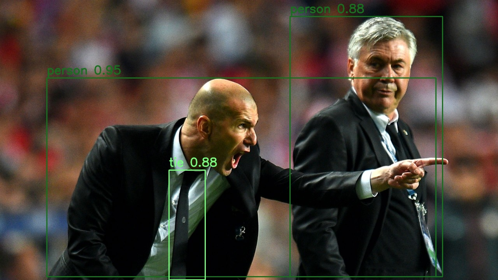
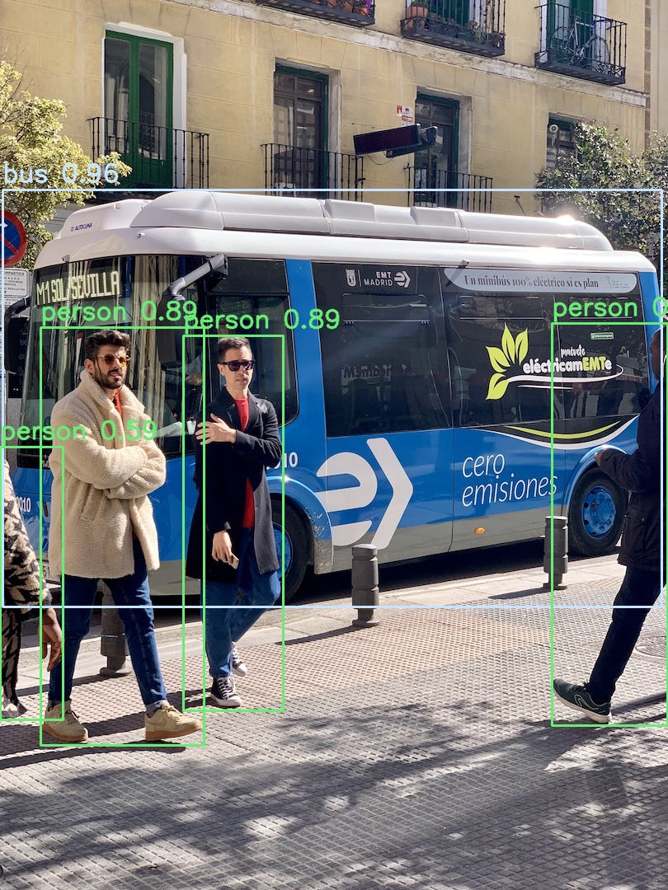

# YOLOV9 TensorRT Add NMS Batched Inference

## Environment
```
torch==1.12.1+cu113
onnxruntime==1.16.3
tensorrt==8.6.1.post1
pycuda==2020.1
```
You can use pycuda or docker ```nvcr.io/nvidia/tensorrt:22.12-py3```
- Install pycuda:
```
git clone --recursive --branch v2020.1 https://github.com/inducer/pycuda.git
export PATH="/usr/local/cuda-11/bin:$PATH"
export LD_LIBRARY_PATH=/usr/local/cuda-11/lib64${LD_LIBRARY_PATH:+:${LD_LIBRARY_PATH}}
nvcc --version
cd pycuda
rm -rf site file
python configure.py --cuda-root=/usr/local/cuda-11
pip install -e .
```

## Convert Yolov9 torch to ONNX
- Open file ```torch2onnx.py``` and update attribute values to suit your model
- Run: 
```
python torch2onnx.py --weights weights/<your_model_name>.pt --output weights/<your_output_model_name>.onnx
```

## Add NMS Batched to onnx model
- Open file ```add_nms_plugins.py``` and update attribute values to suit your model
- Run:
```
python3 add_nms_plugins.py --model weights/<your_output_model_name>.onnx
```

## Convert ONNX model to TrT model
- Run:
```
/usr/src/tensorrt/bin/trtexec --onnx=weights/<your_output_model_name>-nms.onnx \
                                --saveEngine=weights/<your_output_trt_model_name>.trt \
                                --explicitBatch \
                                --minShapes=input:1x3x640x640 \
                                --optShapes=input:4x3x640x640 \
                                --maxShapes=input:4x3x640x640 \
                                --verbose \
                                --device=0
```

## Inference:
- Open file object_detector_trt_nms.py and modify attribute values
- Run:
```
python3 object_detector_trt_nms.py --weight weights/<your_trt_model>.trt --img_test <path_image>
```
- Eg result inference checkpoint yolov9-c.py[] by TensorRT:




